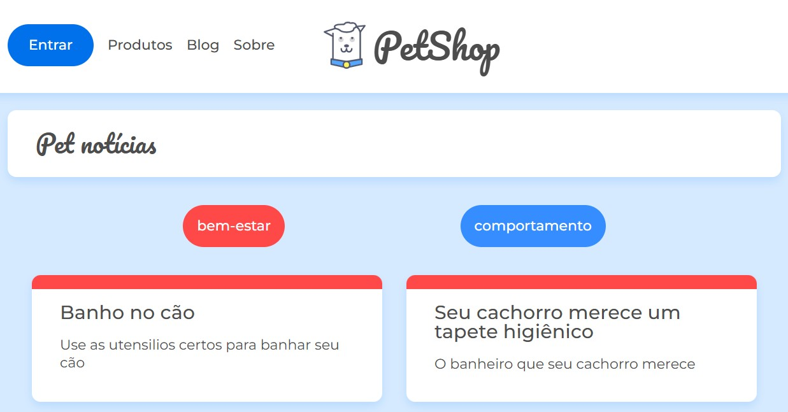

# Projeto React do PetShop

Criação de um projeto React para a página de PetShop, utilizando filtros para classificar as informações.

## Tecnologias utilizadas

- React
- TypeScript
- JavaScript
- CSS

## Scripts

Neste diretório, pode rodar os seguintes scripts:

### Subir o banco de informações

Para subir as informações em um servidor, rodar o comando `npm run server`

### Rodar o projeto

Para subir o projeto, abra o terminal e realize o comando `npm start`.

A página abrirá no endereço [http://localhost:3000](http://localhost:3000) para visualizar em seu navegador.
